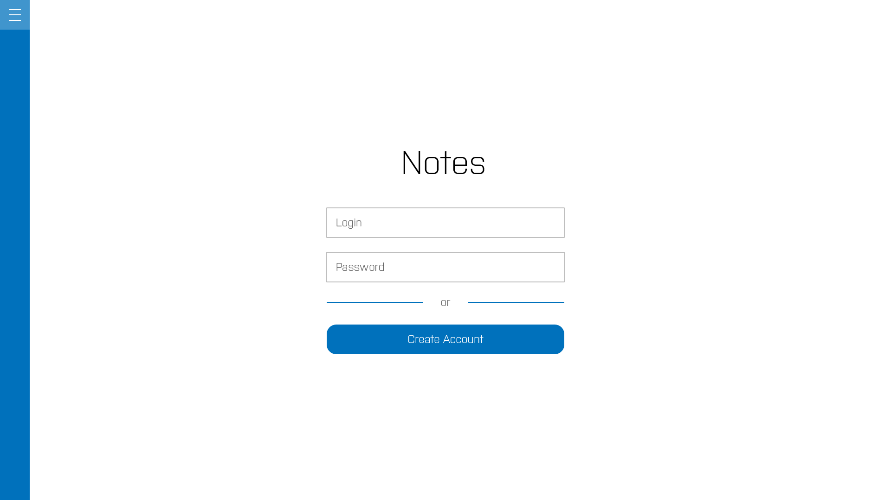
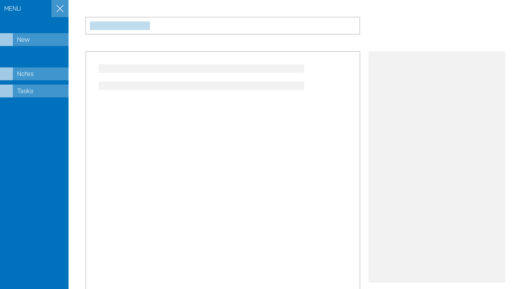

# Notes - Веб-приложение Заметки

## Содержание
1. Описание проекта
2. Основные задачи
3. Структура проекта

    1. Frontend
    2. Backend

4. Черновое описание

## Описание
Notes - Веб-приложение для создания заметок и задач.

## Основные задачи
* Многопользовательский функционал (работа с приложением обеспечивается посредством учетных пользовательских аккаунтов)
* Хранение данных (Закрытом, Частном и Открытом доступе)
* Создавать заметки (с добавлением текстовых данных и/или мультимедия),
* Создавать задачи (которые могут ссылаться на другие задачи, тем самым формируя подзадачи для отслеживания прогресса)

## Структура проекта
1. Frontend

    1. Главная

        * О Приложении (Представление приложения пользователю, краткое описание, основные возможности)

    1. Авторизация

        * Поле ввода имени учетной записи (Ограничения на латинницу, максимум 32 символа)
        * Поле ввода пароля (Ограничения на латтиницу, максимум 32 символа)
        * Кнопка для регистрации новой учетной записи

    2. Регистрация

        * Поле ввода имени учетной записи (Ограничения на латинницу, максимум 32 символа)
        * Поле ввода пароля (Ограничения на латинницу, максимум 32 символа)
        * Поле ввода подтверждение пароля
        * Блок-кнопки (Создать учетную запись / Отмена регистрации - возвращает пользователя на страницу логинизации)

    3. Панель управления

        * Меню
            * Кнопка создать (при нажатии вызывается подменю с выбором создать заметку или задачу, и последующим выводом pop-up диалога создания)
            * Вкладка Заметки
            * Вкладка Задачи
                * Кнопка-фильтр: Все (Фильтрует выводимые задачи в Блок-таблице заполняя таблицу "всеми" задачами из бд)
                * Кнопка-фильтр: Предстоящие (Фильтрует выводимые задачи в Блок-таблице заполняя таблицу задачами из бд у которых прогресс выполнения 0)
                * Кнопка-фильтр: В процессе выполнения (Фильтрует выводимые задачи в Блок-таблице заполняя таблицу задачами из бд у которых прогресс выполнения от 0 до 100)
                * Кнопка-фильтр: Завершенные (Фильтрует выводимые задачи в Блок-таблице заполняя таблицу задачами из бд у которых прогресс выполнения 100)

        * Блок-список инструментов

            * Добавить (в зависимости от выбранной вкладки заметки/задачи выводит pop-up диалога добавления заметки/задачи)
            * Удалить (выделенный элемент и/или выбранные через Checkbox)
            * Изменить степень важности (выделенный элемент и/или выбранные через Checkbox)

        * Блок-таблица (заметки/задачи выводятся сюда)
            * Checkbox (для массового выделения)
            1. Степень важности
            2. Название
            3. Описание (Частично показывается)
            4. Дата добавления
            * Прогресс выполнения (Виден только для задач)

        * Контейнер с информацией (сведения о выбранном элементе в блок-таблице заметок/задач)

            1. Название (2x ЛКМ для редактирования, сохранение по дефокусировке элемента)
            2. Описание (2x ЛКМ для редактирования, сохранение по дефокусировке элемента)
            3. Контент задачи

                * Для заметок

                    * Текстовый блок (2x ЛКМ для редактирования, сохранение по дефокусировке элемента)
                    * Блок прикрепленных медиа-файлов (Список из файлов с иконками на удаление и скачивание, 1x ЛКМ по файлу для предпросмотра [только изображения и видео HTML5])
                    * Кнопка-поле Drag-n-drop для добавления файлов

                * Для задач
                    * Список подзадач с Checkbox для отметки прогресса выполнения ``У каждой задачи как минимум 1 подзадача`` (с названием и описанием подзадачи, иконкой на удаление)
                    * Кнопка добавить подзадачу (Добавляет новую подзадачу в список задачи)

            4. Параметры задачи

                1. Чтение

                    * Закрытый (может видеть только владелец)
                    * Частный (могут видеть только указанные пользователи)
                    * Открытый (доступен по ссылке)

                2. Редактирование

                    * Только автор
                    * Выбранные пользователи
                    * Все
    * Настройки

        * Возможность изменить пароль
        * Возможность удаления аккаунта

2. Backend

    TBD

## Черновое описание

* Главная (описание приложения)

TBD
* Авторизация

* Панель управления

